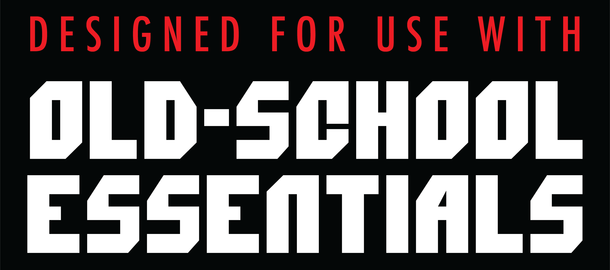

---

### THIS SRD IS UNDER CONSTRUCTION!

# REorganized. REpublished. REmastered!

### What is OSE SRD REmastered?

This is an "Americanized" adaptation of the Old-School Essentials (OSE) SRD REformatted in Markdown (.MD) for easy export to other publishing formats. Please report any issues or discrepancies within the material itself; see Discussions & Issues below.

The material contained herein was REmastered line-by-line into Markdown format to be utilized in your own OSE projects. I have painstakingly converted the original [OSE SRD](https://oldschoolessentials.necroticgnome.com/srd/index.php/Main_Page) to markdown, plus all current errata. In addition, I have converted all Brittish-spellings to American-spellings. For example, armour to armor, colour to color, etc. Also, I have taken the liberty of grammar-checking all material and rewording some sentences for clarity. Bear in mind, I'm only human. For more information, please visit the [SRD Wiki](https://srd.wiki).

**The Systems Reference Document (SRD)** contains guidelines for publishing contains guidelines for publishing content under the Open-Gaming License [OGL](https://oldschoolessentials.necroticgnome.com/srd/index.php/Open_Game_License) or [Creative Commons Attribution 4.0 International License](https://creativecommons.org/licenses/by/4.0/legalcode) (“CC-BY-4.0”).

 
Why Markdown format?

Markdown is a lightweight markup language with plain text formatting syntax created by [John Gruber](https://daringfireball.net). By its very nature, being a plain text file, it is designed to add future-proofing to any set of documents while still maintaining basic text and table formatting options. In addition, Markdown may be exported to HTML and many other formats using a number of various Markdown editors. Markdown is often used to format readme files, for writing books, blogs, and messages, or to simply create rich text using plain text in a Markdown editor.

 
Export Options

I recommend using the following Markdown applications to edit the material:

* [Typora](https://typora.io): $15 (Pay Once)
* [Visual Studio Code](https://code.visualstudio.com/Download): FREE!

To export Markdown to various publishing formats, I recommend using Typora (listed above) as it has many good export options which will satify the majority of users. Most any good Markdown editors will offer basic exports. However, if you want more options, [PanWriter](https://panwriter.com) is the best solution. However, for PanWiter to function properly, the following applications must also be installed to maximize your export options:

* [Download PanDoc](https://github.com/jgm/pandoc/releases/download/2.19.2/pandoc-2.19.2-macOS.pkg)

Alternatively, you can install pandoc using Homebrew:

`brew install pandoc`

Homebrew can also install other software that integrates with Pandoc. For example, to install librsvg (its rsvg-convert covers formats without SVG support), Python (to use Pandoc filters), and BasicTeX (to typeset PDFs with LaTeX):

`brew install librsvg python homebrew/cask/basictex`

Note: On unsupported versions of macOS (more than three releases old), Homebrew installs from the source, which takes additional time and disk space for the ghc compiler and dependent Haskell libraries.

There is a zip file containing the binaries and man pages, for those who prefer not to use the installer. Simply unzip the file and move the binaries and man pages to whatever directory you like.

By default, Pandoc creates PDFs using LaTeX. Because a full MacTeX installation uses four gigabytes of disk space, we recommend BasicTeX or TinyTeX and using the tlmgr tool to install additional packages as needed. If you receive errors warning of fonts not found:

`tlmgr install collection-fontsrecommended`

 
Obsidian Friendly

This adaption of the OSE SRD is designed specifically for PKM applications like Obsidian. [Obsidian.md](https://obsidian.md) is a powerful knowledge base on top of a local folder of plain text Markdown files. That definition sounds simple; however, Obsidian is much, much more. Visit [Josh Plunket's YouTube Channel](https://www.youtube.com/c/JoshPlunkett/videos) to learn more about using Obsidian for your roleplaying game campaign management.

 
Discussions & Issues

Feel free to visit our [discussion](https://github.com/OldManUmby/OSE.SRD.Wiki/discussions) forum to examine publishing ideas regarding the D&D SRD. Please **REport** any [issues](https://github.com/OldManUmby/OSE.SRD.Wiki/issues) you find through Github. As an alternative, you can **REfork & REuse** this project through a GitHub [pull request](https://github.com/OldManUmby/OSE.SRD.Wiki/pulls).

 
Get Downloads

* Download the latest [Release](https://github.com/OldManUmby/OSE.SRD.Wiki/releases).
* Download OSE official [Basic Rules](https://necroticgnome.com/products/old-school-essentials-basic-rules).
* Download OSE official [Errata](https://docs.google.com/document/d/1dzQnig4CNET8-1yLJgOfYdssc70oUp5rGfGUZuBZBQE/edit#heading=h.8u1si328qbpn).
* Download OSE official [Characters Sheets]([http://dnd.wizards.com/articles/features/character_sheets](https://necroticgnome.com/collections/free-downloads)).

---

**Disclaimer:** Old-School Essentials is a trademark of Necrotic Gnome. The trademark and Old-School Essentials logo are used with permission of Necrotic Gnome, under license. For more information about Old-School Essentials or other intellectual property, please visit their website at [www.necroticgnome.com](http://www.necroticgnome.com).

Website, markdown conversion, and extended formats by [Old Man Umby](http://www.oldmanumby.com).
